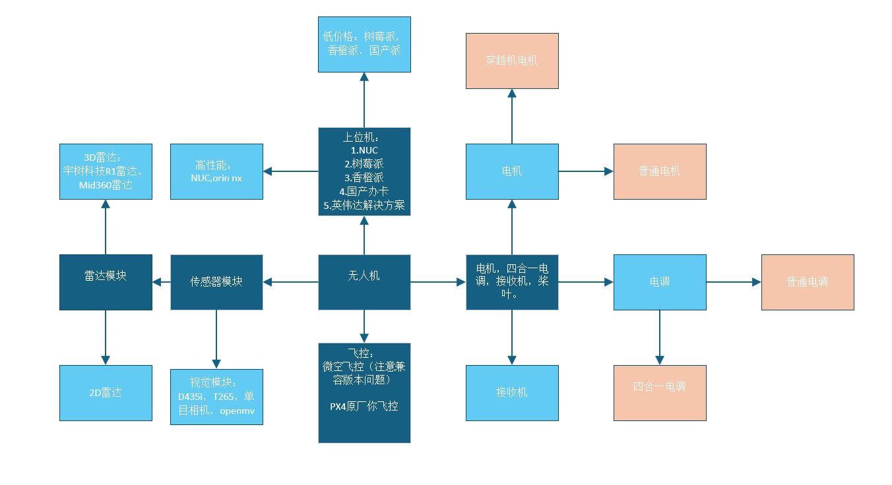
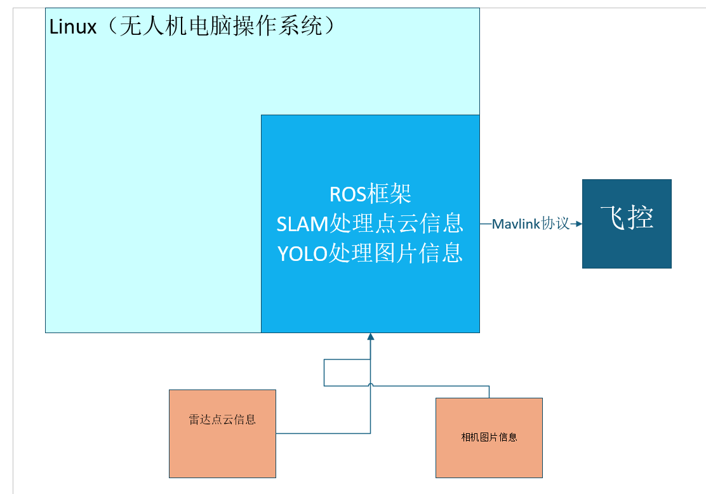

# REDME

对于无人机从业人员刚开始入门ROS无人机总是十分困难的，无论是从知识层面还是从经济层面总是困难重重，因此，在这个项目中会提到如何从零开始实现一个从零到实现一个自己无人机飞行的学习路径并对各位准开发人员提出合理的建议。

## 1.关于组装：

为了帮助大家更好的理解在这里引入结构图，里面涵盖了需要使用的所有零件。

### 1.1无人机零件：

#### 1.1.0能源套件：

- 电池：提供电力

  **标称电压（Voltage, V）**

  - 单节 LiPo 电池标称电压是 **3.7V**（满电约 4.2V，放电到 3.0V 左右算低电）。
  - 多节电池用 **S** 表示，比如 3S = 11.1V（3×3.7V），4S = 14.8V，6S = 22.2V。
  - 电压越高，电机能提供更大功率，但对电调和电机要求也更高。

  **容量（Capacity, mAh / Ah）**

  - 表示电池能储存的电量，例如 5200mAh = 5.2Ah。
  - 容量越大，理论续航越长，但重量也会增加。

  **能量（Energy, Wh）**

  - 公式：**Wh = V × Ah**。
  - 用于比较不同电池的实际储能大小。

#### 1.1.1动力套件

- 机架：机架是放置无人机零件的，包括450的机架，350 机架等，这些机架的型号的数字是以机架的轴距进行命名的
  - 轴距：指的是无人机的技艺在机臂上的最远两端的距离
- 电机：为无人机的电机提供动力，包括穿越机电机和普通无人机的电机。常见型号包括2216指的是底面直径和厚度
- 桨叶：命名方式以直径和螺距进行命名如1045是值10英寸直径，4.5英寸螺距
  - 螺距：桨叶在理想条件下旋转一圈前进的理论距离。例如 4.5 表示一圈推进 4.5 英寸。

#### 1.1.2控制套件：

- 飞控：无人机的小脑，作用是控制无人机在飞行过程中的平衡姿态，包括飞行过程中的平衡姿态和运动过程中的姿态。
- 电调：将电源的直流电转换为三相交流电，并通过飞控输入的PWM信号控制无人机的电机的功率的大小
  - 性能指标：A，一般情况下分为20A和40A，还有四合一电调采用的性能指标是4个电源合起来通过的电流
- 遥控器：发出控制信号并通过接收机传递给无人机让无人机进行合理的飞行
- 接收机：接受遥控器的信号，将遥控器的信号传递给接收机
- 机载电脑：通过电脑计算的结果传递给飞控，让无人机实现自主飞行的效果，这个就是我们学习想要达成的目标

==在这里很多人存在疑惑，对于无人机的遥控器和机载电脑和遥控器的指令是否会存在矛盾，准确的说无人机想要变成机载电脑控制需要对于无人机的模式进行修改，可以通过无人机遥控器上面的通道实现==

#### 1.1.3外部传感器：

通常情况下无人机的内部是内置了IMU传感器模块用来感应不同方向的加速度，从而保持稳定，单一般来说稳定性不是很好，同时也没有办法很好的解决和外界的相对坐标，以及处理视觉数据的问题，所以我们需要额外购买外部传感器来解决这个问题。

- 雷达：雷达会采集周围通过激光反射得到的点云信息，然后通过算法的处理得到一个基于点云格式的周围2D或者是3D的建图，帮助机器人理解周围的相对坐标信息

- 相机：用于将周围图片信息传递给电脑进行处理。并将处理的结果用于无人机飞行逻辑的判断。

  

**在后面回单独给出章节进行无人机的组装进行讲解**

## 2.软件框架：

准开发人员这总是对机载电脑如何对无人机进行控制处于一种朦胧的思考状态，下面这张图可以很好的解释无人机的机载电脑如何对无人机进行操作

### 2.1ROS：

在讲解ROS之前首先需要明白linux操作系统，Linux操作系统实际上是一种内核，本身的作用类似于汽车的发动机，但是不同的厂家对这个发动机进行了不同的处理，因此产生了不同的车辆，但是内核都是一致的，Linux同样也有很多发行版本，我们这篇文章都是基于ROS noetic进行开发，这个版本的ROS只可以在ubuntu20.04上进行使用，因此需要将机载电脑配置好ubuntu20.04的环境进行开发。

使用Linux的原因是Linux的命令行很方便的可以对计算机底层和接口上的东西进行访问，可以简化操作流程。

#### 2.1.0：ROS逻辑

ROS本身的逻辑就类似于一个软件，但是这个软件是基于Linux的并且方便使用，方便机器人模块化的开发模式，因此ROS是目前主流的开源的机器人操作系统，后面准开发者们会感受到这个操作系统的强大。

#### 2.1.1ROS与雷达：

ROS会将雷达传递的信息，通过开源的算法，绘制好周围环境的地图，这个开源的算法有一个比较统一的外号我们成为SLAM，也是目前主流的机器人定位算法，帮助机器人很好的理解周围的相对坐标

#### 2.1.2ROS与相机：

目前采用的主流的方式是将模型训练好部署到我们的无人机上人，然后呢读取无人机相机中的信息，然后转换为数据发送给写好的ROS文件进行集中处理，然后输出无人机飞行的指令。

#### 2.1.3ROS与飞控：

ROS与飞控的交互使用过一个名为MAVlink的协议将线从机载电脑链接到飞控上进行交互，无人机就可以理解飞行的指令，然后进行飞行指令的调整。

### 2.2QGC（PX4固件）

我们知道，基于硬件算法会不断的迭代，就像各位的收集操作系统的版本一样，QGC的功能就是将不同版本的PX4的算法程序刷写进入PX4的飞控中

- 官网：[QGroundControl – Drone Control – Ground Control Station for Small Air – Land – Water Autonomous Unmanned Systems](https://qgroundcontrol.com/)

我们可以在官网上找到QGC的使用教程，但是一部分写的比较含糊的地方需要大家借助博客进行理解。

## 3.专有名词讲解：

- 炸机：无人机由于飞行过程中某种原因损坏
- ROS：机器人操作系统，本质是一个 **消息通信框架 + 工具集**，让无人机的各个模块（感知、控制、导航）可以解耦协作。
- PX4 / ArduPilot：开源飞控系统。ROS 无人机常用 PX4 作为 **底层飞控固件**，负责姿态控制、电机驱动。
- **Gazebo**
   常用的机器人仿真器，可以加载无人机模型（iris 等）进行虚拟飞行测试。
- **GPS / GNSS**
   卫星定位，ROS 中一般通过 `/mavros/global_position` 话题获取
- **MAVROS**
   → ROS 的一个软件包，是 MAVLink ↔ ROS 的桥接器。
   MAVLink 是无人机飞控常用的通信协议（轻量二进制消息），MAVROS 把这些消息转换为 ROS 话题和服务。
- **OFFBOARD 模式**
   → PX4 的一种飞行模式。飞控不再自己规划路径，而是等待外部（ROS 节点）发送控制指令（如位置 setpoint）。实现自主控制时必须进入这个模式。
- **Arming / Disarming（解锁/上锁）**
   → 上锁 = 电机不转，解锁 = 电机可以转动。所有无人机飞行前都要先 “解锁”，结束时 “上锁”。
- **EKF（Extended Kalman Filter 扩展卡尔曼滤波器）**
   → 飞控里的状态估计算法，把 IMU、GPS、视觉等数据融合，得到无人机的位置、姿态。没有 EKF 就没法飞稳。
- **NED（North-East-Down）**
   → 飞控内部常用坐标系：X 北、Y 东、Z 向下。
- **ENU（East-North-Up）**
   → ROS 常用坐标系：X 东、Y 北、Z 向上。
   👉 MAVROS 会自动做 NED ↔ ENU 转换，所以你在 ROS 里看到的位置 Z 轴向上。
- **Gazebo** → 物理仿真环境，可加载无人机模型进行虚拟飞行。
- **RViz** → 可视化工具，用来显示位置、轨迹、点云、相机画面。

### 4.后言：

前面是对ROS无人机进行了一个最基本的概述，后面我会对前面的知识点一步一步的进行细化，并做成文章，放到github上帮助大家的学习。

