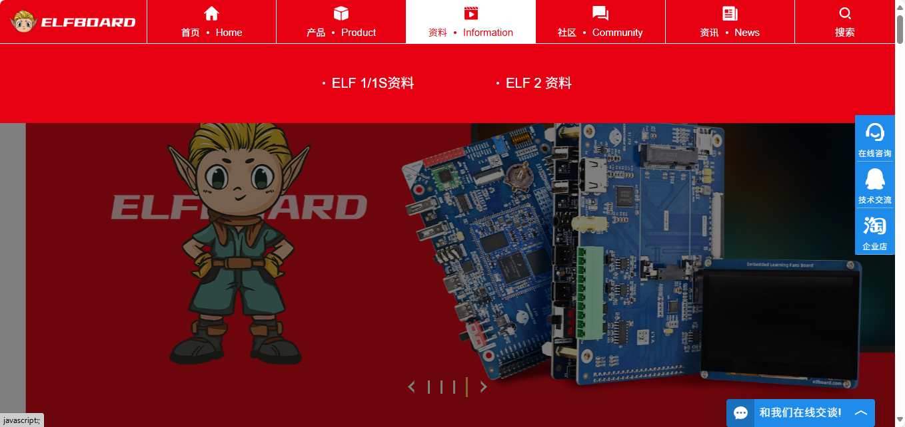
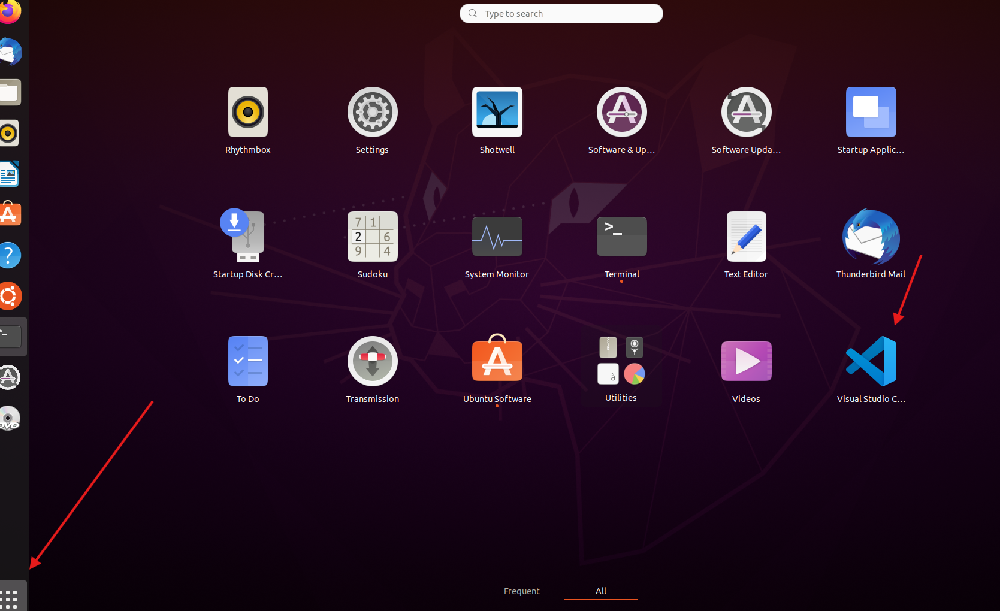
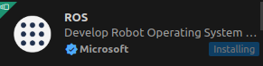

# 无人机仿真


## 1.虚拟机安装：

### 1.1**软件VMware**：

- 下载地址：[ElfBoard 官网-嵌入式Linux开发板/学习板-让嵌入式学习释放无限可能](https://www.elfboard.com/)。

  点击资料，然后选择ELF2资料：

  

​	向下拉至资料下载，点击下载”06-常用工具“，点进文件夹后点击“环境搭建工具”


​	点进后下载这个文件：


​	下好之后双击exe进行下载，之后可以按照自己的需求勾选选项，其中若弹出自动安装WHP，可勾选


​	之后一直下一步就OK了，当然如果自己对某些方面有需求可以选择性勾选，比如要不要自动检查更新，要不要加入家族啊之类的，可以不勾选。


双击进入VMware，需要输入密钥


​	任选其一即可。

### 1.2Ubuntu20.04安装：

ubuntu20.04.06官网地址：[Ubuntu 20.04.6 LTS (Focal Fossa)](https://www.releases.ubuntu.com/focal/)

下拉选到图片中指向的位置：


选择图片中选择的位置，这个就是Ubuntu20.04.06的长期维护版本。

### 1.3VMware创建虚拟机

点击创建新的虚拟机，之后会弹出这个界面


下一步，注意要改成稍后安装系统


​	然后选择Linux系统，Ubuntu不用改


​	虚拟机的名称无所谓，但是放的地方有所谓，你需要给虚拟机留足够大的空间，那么最好给他放在一个很大的盘里，一般来说对于新加内存的笔记本来说，E盘会是最大的，视你情况而定，但是不要下在C盘里面


磁盘的要求最低为60个G


​	之后一直点下一步就行，之后回到了你的VMware主页，但这时多了一个虚拟机，你要在下面点击这个CD/DVD进行配置


​	将此处改为使用ISO映像文件，并导入你刚刚下好的ubuntu的iso文件，并不要随意更改文件的位置


​	打开虚拟机，进入界面后等待一段时间是这样的：点击Install Ubuntu


使用它给我们默认的美式英语，点击continue


按照默认来


​	之后它给我们定位到上海，不要改了

​	之后起名字，起你想起的名字，但值得注意的是对密码的设置，建议设置密码为一个空格，这样方便记忆，也方便之后的操作，你可以选择自动登录（log in automatically）也可以选择需要密码登录（Require my password to log in）


​	接下来是漫长的等待，然后它让你重启一下电脑


​	键盘按下enter进入，遇到如下界面，skip，然后next。


​	然后就结束辣！这时进入之后就可以ctrl+alt+t打开终端开始操作了。


## 2.ROS安装：


### 2.1鱼香ROS一键安装：

按下Ctrl+Alt+T,输入下面的代码：

```bash
wget http://fishros.com/install -O fishros && . fishros
```

进入下面的界面：


  接着 ，输入数字5，回车，一键配置系统源


​    输入数字2，回车，更换系统源并清理第三方源


在后面安装ROS的过程中选择ROS-noetic版本就可以。


### 2.2VScode安装配置：

在ubuntu官方的软件商城进行选择即可。


然后进去之后在这个位置我们可以查找VScode 


很好我们的第一个就是那么我们点击进去之后进行下载操作

点击进入之后进行下载操作。




点击这个界面然后进入Vscode 的界面然后进行一些配置

我们要下载下面的插件：

1.ROS :用于编辑ROS文件

2.CMake：用于编译C++工程。

3.：Chinese：用于进行VScode的汉化。

4.python：用于编写python代码。


进来之后点击左边进入插件下载界面，右边则表示插件的搜索。




## 3.仿真环境配置：


### 3.1mavros安装：


在终端中输入下面的指令：

```bash
sudo apt install ros-noetic-mavros*
sudo /opt/ros/noetic/lib/mavros/install_geographiclib_datasets.sh
```

### 3.2PX4安装：

**MAVROS：通信桥梁**

- **定义**：
  - **MAVROS**（MAVLink ROS）是一个基于ROS（机器人操作系统）的功能包，用于在机载计算机（运行ROS）和飞控（如PX4）之间建立通信。它通过 **MAVLink协议** 实现消息的编码、解码和传输。
- **核心作用**：
  - 将ROS消息（如目标位置、姿态指令）转换为MAVLink消息，发送给飞控。
  - 接收飞控的状态数据（如位置、电池信息），并发布为ROS话题。
- **典型应用**：
  - 发送控制指令（位置、速度、姿态）。
  - 接收传感器数据（IMU、GPS、电池状态）。
  - 切换飞行模式（如切换到Offboard模式）。

**Offboard模式：外部控制接口**

- **定义**：
  - **Offboard模式** 是PX4飞控的一种飞行模式，允许无人机通过外部系统（如机载计算机）发送的实时指令进行控制，而非依赖遥控器或预设任务。
- **核心作用**：
  - 接收外部系统的控制指令（如位置设定点、速度指令），实现自主飞行。
  - 要求外部系统持续发送指令（否则触发超时保护，切换为其他模式）。
- **典型应用**：
  - 基于视觉/SLAM的自主导航。
  - 复杂轨迹跟踪（如避障、编队飞行）。

#### 3.2.1安装PX4

==如果网络出现问题请联系负责人==

PX4 由两个主要部分组成：一是飞行控制栈（flight stack） ，该部分主要包括状态解算和飞行控制系统；另一个是中间件，该部分是一个通用的机器人应用层，可支持任意类型的自主机器人，主要负责机器人的内部/外部通讯和硬件整合，包含各种硬件驱动、[uORB Messaging](https://www.yuque.com/easonhua/nx9k7f/cbe96s03cv6vovo5)、MAVLINK协议等

**飞行控制站**：

飞行堆栈是自主无人机制导、导航和控制算法的集合。它包括固定翼、多旋翼和垂直起降机身的控制器以及姿态和位置估计器。

它包含从传感器、RC输入和自主飞行控制（导航器）到电机或伺服控制（执行器）的完整通道。


本章需要在GitHub上下载相关的飞控版本:

- git工具下载（用于在GitHub上拉下资源）

```bash
sudo apt update
sudo apt install git -y
```

- 安装PX4（用于仿真的ROS工具包）

```bash
cd
git clone https://github.com/PX4/PX4-Autopilot.git --recursive --branch v1.13.3
cd ~/PX4-Autopilot
git submodule update --init --recursive
```

你可能会在下载过程中遇到网络问题，如下如所示：


不用担心，这是正常情况。clone完成后，进入这个文件夹，重复执行以下指令

```bash
cd ~/PX4-Autopilot
git submodule update --init --recursive
```

直到终端没有任何输出，如下图所示。


如果因为某些问题无法正常下载访问该链接进行下载：

通过网盘分享的文件：PX4-Autopilot.zip
链接: https://pan.baidu.com/s/1RwlOMKS4GkosIMKif8bGeA?pwd=7bt2 提取码: 7bt2 
--来自百度网盘超级会员v4的分享

安装一些依赖包：

```bash
sudo apt install python3-pip
pip3 install --user toml empy jinja2 packaging
```

按顺序执行以下指令，进行环境配置。

```bash
cd ~/PX4-Autopilot
source ./Tools/setup/ubuntu.sh
```

**出现闪退问题**：

-  1.网络连击问题，请检查网络，或者连接手机热点进行下载
- requirements.txt格式错误

source过程中执行了以下指令，但是`requirements.txt`格式错误导致的，可以用以下指令进行排查：

```bash
cd ~/PX4-Autopilot && pip3 install -r Tools/setup/requirements.txt
```

如果你得到的输出结果如下图所示，说明确实是这个原因：


我们可以手动修改报错的位置，将`matplotlib>=3.0.*`改为`matplotlib>=3.0`


修改后，再执行，检查有无报错：

```bash
cd ~/PX4-Autopilot && pip3 install -r Tools/setup/requirements.txt
```

- 某个 apt 源不可达


 用 fishros 工具换源

更换系统源并清理第三方源

- .bashrc配置死循环

如果之前安装过`PX4-Autopilot`并配置过`~/.bashrc`，那么很可能之前配置好的环境干扰到了本次安装的环境，出现了死循环。

因此需要将`.bashrc`中如下三行进行注释：


- nuttx 安装错误：

`nuttx`是进行`PX4`代码编译开发的工具，不安装也能正常编译。因此执行`source ./Tools/setup/ubuntu.sh`时，加上`--no-nuttx`后缀

```bash
source ./Tools/setup/ubuntu.sh --no-nuttx
```

或者直接在`ubuntu.sh`中将`install-nuttx`改为`False`。

#### 3.2.2编译PX4：

source完成后，执行以下指令开始编译

```bash
rm -rf ~/PX4-Autopilot/build
cd ~/PX4-Autopilot
make px4_sitl_default gazebo
```

编译结束后，会自动运行`Gazebo`仿真环境并加载`iris`无人机：


#### 3.2.3配置PX4：

打开.bashrc，

```bash
sudo apt update
sudo apt install gedit -y
gedit ~/.bashrc
```

在文件末尾添加以下内容：

```bash
source ~/PX4-Autopilot/Tools/setup_gazebo.bash ~/PX4-Autopilot/ ~/PX4-Autopilot/build/px4_sitl_default
export ROS_PACKAGE_PATH=$ROS_PACKAGE_PATH:~/PX4-Autopilot
export ROS_PACKAGE_PATH=$ROS_PACKAGE_PATH:~/PX4-Autopilot/Tools/sitl_gazebo
```

安装完 PX4 之后，每次打开终端会出现一大堆东西


## 4.仿真飞行：

### 4.1简单代码编写:

```bash
mkdir -p ~/catkin_ws/src		//创建一个工作空间
cd catkin_ws/src
cd ..
catkin_make						//对工作空间进行编译操作
```


后面的蓝色出现的现象属于正常现象，可能是因为内存不够

然后我们在终端中输入

````bash
code .
````

后面加上`.`表示在当前的目录下打开vscode，如果没有`.`表示打开上一次打开的文件


点击这个`create catkin package`然后第一次输入文件的名字然后第二次输入相关的依赖


第二次我们输入相关的依赖，这些依赖的顺序没有什么关系

```bash
rospy roscpp std_msgs geometry_msgs mavros_msgs
```


然后我们在src文件下面新建一个文件，名字命名为`offboard_node.cpp`


然后我们将下面的代码塞入进去

```python
/**
 * @file offb_node.cpp
 * @brief Offboard control example node, written with MAVROS version 0.19.x, PX4 Pro Flight
 * Stack and tested in Gazebo SITL
 */

#include <ros/ros.h>
#include <geometry_msgs/PoseStamped.h>
#include <mavros_msgs/CommandBool.h>
#include <mavros_msgs/SetMode.h>
#include <mavros_msgs/State.h>

mavros_msgs::State current_state;
void state_cb(const mavros_msgs::State::ConstPtr& msg){
    current_state = *msg;
}

int main(int argc, char **argv)
{
    ros::init(argc, argv, "offboard_node");
    ros::NodeHandle nh;

    ros::Subscriber state_sub = nh.subscribe<mavros_msgs::State>
            ("mavros/state", 10, state_cb);
    ros::Publisher local_pos_pub = nh.advertise<geometry_msgs::PoseStamped>
            ("mavros/setpoint_position/local", 10);
    ros::ServiceClient arming_client = nh.serviceClient<mavros_msgs::CommandBool>
            ("mavros/cmd/arming");
    ros::ServiceClient set_mode_client = nh.serviceClient<mavros_msgs::SetMode>
            ("mavros/set_mode");

    //the setpoint publishing rate MUST be faster than 2Hz
    ros::Rate rate(20.0);

    // wait for FCU connection
    while(ros::ok() && !current_state.connected){
        ros::spinOnce();
        rate.sleep();
    }

    geometry_msgs::PoseStamped pose;
    pose.pose.position.x = 0;
    pose.pose.position.y = 0;
    pose.pose.position.z = 2;

    //send a few setpoints before starting
    for(int i = 100; ros::ok() && i > 0; --i){
        local_pos_pub.publish(pose);
        ros::spinOnce();
        rate.sleep();
    }

    mavros_msgs::SetMode offb_set_mode;
    offb_set_mode.request.custom_mode = "OFFBOARD";

    mavros_msgs::CommandBool arm_cmd;
    arm_cmd.request.value = true;

    ros::Time last_request = ros::Time::now();

    while(ros::ok()){
        if( current_state.mode != "OFFBOARD" &&
            (ros::Time::now() - last_request > ros::Duration(5.0))){
            if( set_mode_client.call(offb_set_mode) &&
                offb_set_mode.response.mode_sent){
                ROS_INFO("Offboard enabled");
            }
            last_request = ros::Time::now();
        } else {
            if( !current_state.armed &&
                (ros::Time::now() - last_request > ros::Duration(5.0))){
                if( arming_client.call(arm_cmd) &&
                    arm_cmd.response.success){
                    ROS_INFO("Vehicle armed");
                }
                last_request = ros::Time::now();
            }
        }

        local_pos_pub.publish(pose);

        ros::spinOnce();
        rate.sleep();
    }

    return 0;
}
```

然后在这个`src`文件里面的cmakelist.txt文件下面加上这几行代码：

```cmake
add_executable(offboard_node src/offboard_node.cpp)
target_link_libraries(offboard_node ${catkin_LIBRARIES})
```


我们将文件保存之后编译一下

这里需要在工作空间下的路径下输入下面的指令：

```bash
catkin_make
source ./devel/setup.bash
```


### 4.2启动仿真：

我们在终端中执行下面的命令：

```bash
roslaunch px4 mavros_posix_sitl.launch
```

注意这个命令需要在PX4-Autopilot文件夹的终端中执行：


然后打开QGC软件：


==可能出现如下不正常情况：==


**解决方案**

我们打开QGC的这个位置


点击这个位置进入下面这个界面：


然后进入下面这个界面进行调整：


椭圆圈住的左边栏拉到最下面，然后点击箭头指向的图标


分析原因是因为程序判断没有接入遥控器，认为不安全，所以不允许起飞。

解决方法为：

在前面的三个终端运行的时候，打开QGC地面站，在参数中搜索`COM_RCL_EXCEPT`


将`COM_RCL_EXCEPT`参数改为`4`并保存。

也可以直接点击我们的offboard的按钮，直接将值修改为4，进行我们值的强制性转换。


解决完成之后继续之前的操作：

```bash
catkin_make
source ./devel/setup.bash
```


我们在终端中执行下面的命令：

```bash
roslaunch px4 mavros_posix_sitl.launch
```


注意这个命令需要在PX4-Autopilot文件夹的终端中执行：


然后打开我们工作空间的文件夹进行下面的操作：

```bash
rosrun offboard_pkg offboard_node
```

如果一切正常，那么恭喜你，无人机起飞了


